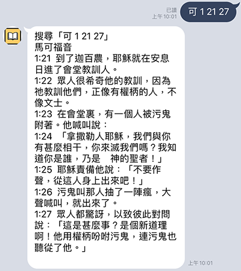

<h1 align=center>拜啵
<h5 align=center>聖經經文查詢Line機器人

<h2> 資料來源</h2>
耶大雅中文聖經工具程式 http://bibletool.konline.org/

* 使用到的API => https://bibletool.konline.org/retrieve/

<h2> 使用方法</h2>

* 開啟Line的加入好友功能，搜尋 @679zbztn

或是掃描QR Code  

* 搜尋章節的格式 `章節縮寫 第幾章 第幾節`  
[查詢章節縮寫](http://springbible.fhl.net/Bible2/cgic201/Doc/abbreviation.html)

* 如果要搜尋 `馬可福音 第1章 第20節` => 跟機器人說 `可1:20` 或 `馬可 1 20` 

* 可以範圍搜尋了! => 跟機器人說 `可 1 21 27` 或 `馬可 1 21~27` 

